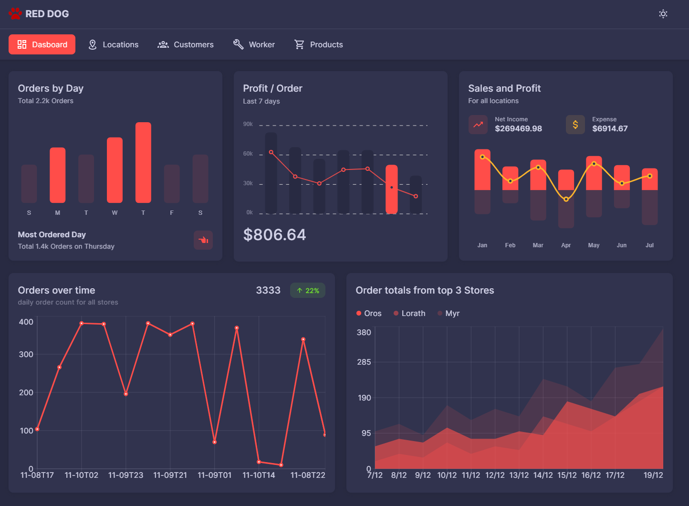
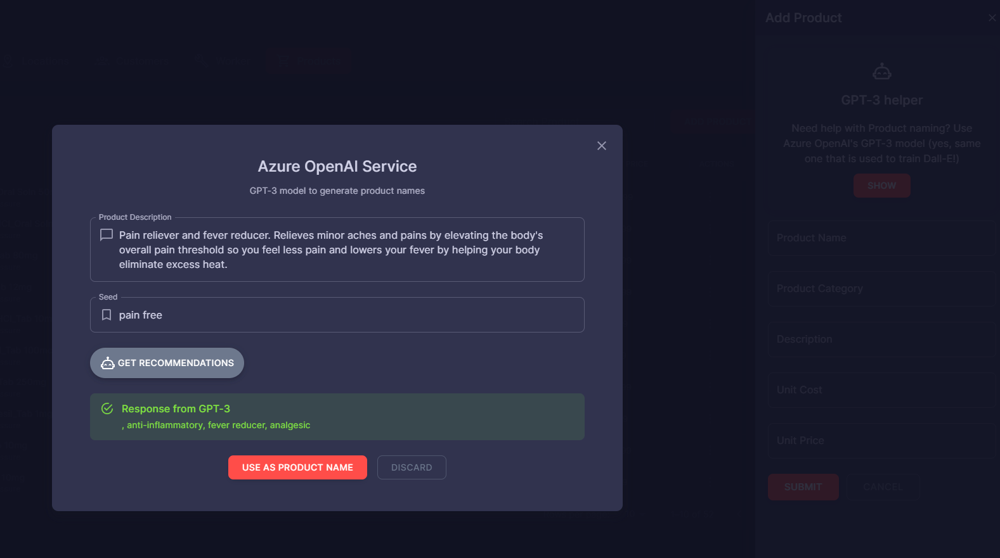
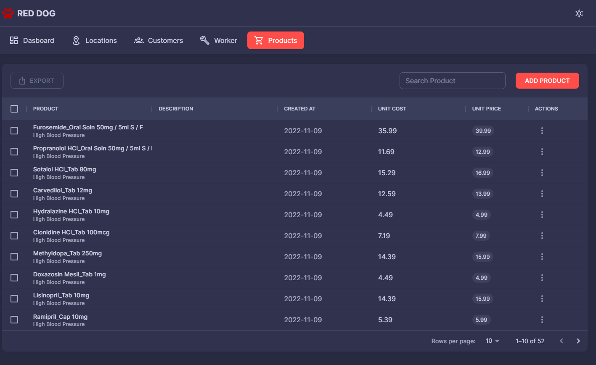
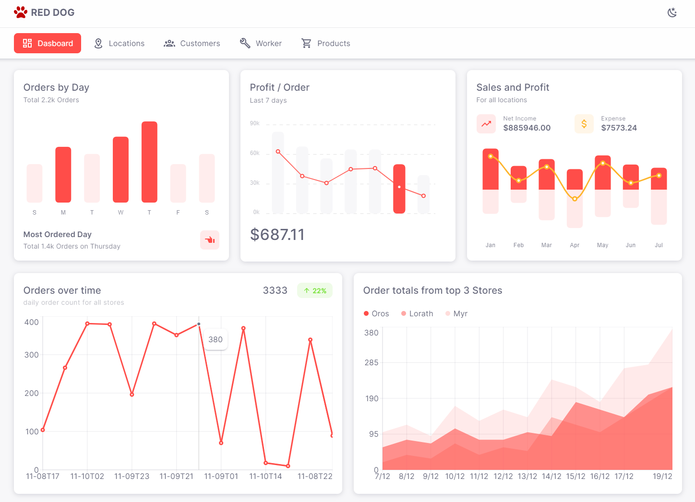
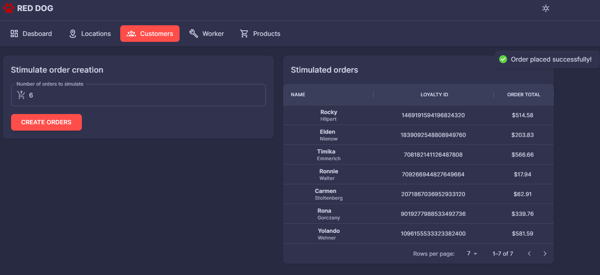

# RED DOG UI - Next.js version
Based on [reddog-code's UI](https://github.com/Azure/reddog-code/tree/master/RedDog.UI), this repo is the frontend for reddog-code. 
It is built with [Next.js](https://nextjs.org/), an opinionated React framework for server-side rendering and static site generation [^fn].
The goal is to highlight Azure integrations, APIs, and services for frontend developers.

### Prerequisites

- [Node.js](https://nodejs.org/)
- [NPM](https://npm.org)
- [Yarn](https://yarnpkg.com)
- [Azure Maps](https://azure.microsoft.com/en-us/services/azure-maps/) subscription key

### Local development
To run locally with env vars

1.  add a `.env.local` file to the root with the following:
```shell
NEXT_PUBLIC_AZ_MAPS_KEY=<Your_Bing_Maps_Api_Key>
```
2. then, run
```shell
yarn install
yarn dev
```
### Screenshots





[^fn]: [Components](https://mui.com/material-ui/getting-started/overview/)
